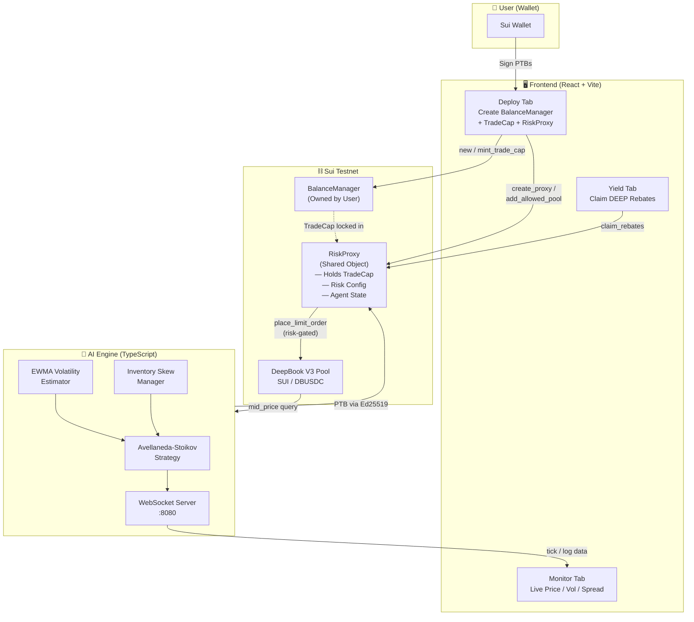

# ⚡️ SurgeBot: Autonomous AI Market Maker for DeepBook V3

SurgeBot is a fully non-custodial, high-frequency AI market maker built exclusively for DeepBook V3 on the Sui blockchain. It utilizes the Avellaneda-Stoikov mathematical model to adjust quotes dynamically based on real-time market volatility.

## 🏆 Hackathon Submission Highlights
- **Trustless Delegation (RiskProxy):** The AI agent is mathematically prevented from stealing your funds. DeepBook V3 requires an owned `TradeCap` to execute trades. SurgeBot locks that `TradeCap` inside a shared smart contract (`risk_proxy.move`) that only forwards execution commands if they pass hard-coded risk checks (max drawdown, max position size).
- **Avellaneda-Stoikov Pricing Engine:** Calculates the reservation price (fair value adjusted for inventory risk) and the optimal spread based on an EWMA volatility estimator. 
- **Dual Yield Farming:** Automatically stakes your DEEP tokens in DeepBook V3 to farm maker rebates and reduce taker fees while quoting.
- **Glassmorphism Dashboard:** A sleek, modern React frontend built with `@mysten/dapp-kit` to deploy and monitor your RiskProxy.

## 🏗 Architecture



### Components

1. **Smart Contracts (`/surgebot`):** Sui Move package containing the `RiskProxy` shared object. It wraps a DeepBook `TradeCap` and enforces risk limits (max position, max loss, pool whitelist) before forwarding trades.
2. **AI Engine (`/engine`):** TypeScript process that queries live DeepBook mid-prices, runs Avellaneda-Stoikov math (reservation price + optimal spread), and submits orders through the RiskProxy.
3. **Frontend Dashboard (`/frontend`):** React + Vite dApp using `@mysten/dapp-kit` to deploy the proxy, whitelist pools, monitor live engine data via WebSocket, and claim DEEP maker rebates.

### Data Flow

1. User connects wallet → sets risk params → signs `create_proxy` PTB
2. Frontend parses created `RiskProxy` + `BalanceManager` object IDs
3. User signs `add_allowed_pool` to whitelist the SUI/DBUSDC pool
4. Engine queries DeepBook mid-price → runs A-S model → submits orders via `risk_proxy::place_limit_order`
5. RiskProxy enforces position & loss limits on-chain before forwarding to DeepBook
6. Engine broadcasts tick data over WebSocket → Frontend renders live dashboard

## 🚀 Quick Start

**1. Deploy Smart Contract**
```bash
cd surgebot
sui client publish --gas-budget 500000000
```

**2. Start the Engine**
```bash
cd engine
npm install
npm run dev
```

**3. Run the Dashboard**
```bash
cd frontend
npm install
npm run dev
```

## 🔒 Security Model
The user retains custody of the `WithdrawalCap`. The `TradeCap` is locked in the shared `RiskProxy`. The AI agent's wallet address is whitelisted inside the `RiskProxy` to call trading functions, but the proxy mathematically enforces max order sizes and daily loss limits.

---
Built with ❤️ for the Sui Hackathon.
